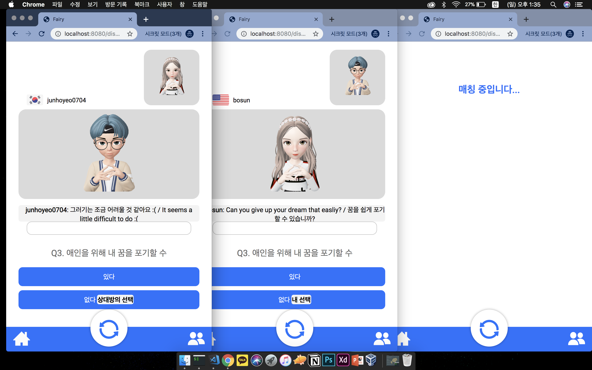

# Fairy Server

## API
서버를 실행하고 [http://localhost:5000](http://localhost:5000)에 접속하면 Swagger UI로 도큐먼테이션을 확인할 수 있음

### 회원가입

### 로그인

### 사용자 정보

### ZEPETO Render API
제페토 Render API를 이용해 사용자의 제페토를 바탕으로 필요한 에셋을 가져옴

#### 프로필(`/render/{user_id}`)

`PHOTOBOOTH_ONE_87` 포토부스는 제페토 얼굴이 명확히 드러나서 다양하게 사용할 수 있음

#### 전신 이미지(`/render/cover/{user_id}`)

캐릭터의 전신 모습이 잘 표현되는 `PHOTOBOOTH_ONE_1`, `PHOTOBOOTH_ONE_10`, `PHOTOBOOTH_ONE_29`, `PHOTOBOOTH_ONE_30`, `PHOTOBOOTH_ONE_136`, `PHOTOBOOTH_ONE_210` 포토부스 중 하나를 랜덤으로 적용해 가져옴

### 소셜

#### 친구 추가

#### 친구 목록

## SocketIO

### 채팅

#### `client.emit('match', token)`
- 새로 connect 또는 셔플 시 사용

#### `client.on('paired')`
- 매칭됨
- 상대방 정보가 들어옴(_id 등등)

#### `client.on('ended')`
- 채팅이 끊김 ~~너 싫대~~

#### `client.emit('talk', {token, target, message})`
- target에게 메세지 전송

#### `client.on('received')`
- 메세지와 번역이 들어옴

#### `client.emit('question', {token})`
- 질문을 가져옴

#### `client.on('questioned')`
- 질문이 들어옴

#### `client.emit('answer', {token, answer})`
- 질문에 웅답

#### `client.on('opponent_answered')`
- 상대방의 응답이 들어옴

#### `client.on('clear')`
- 해당 질문이 끝남

#### `client.on('end_questions')`
- 질문하기가 끝남

### 프레임 처리

#### `client.emit('processed', 'data:image/png;base64,'`
- 프레임을 전송

#### `client.on('processed')`
- 처리된 프레임을 수신

## Related Repos

- [JunctionXseoul2019(kwonbosung02)](https://github.com/kwonbosung02/JuntionXseoul2019): mask face with ZEPETO

- [Fairy-zepeto-frontend](https://github.com/junhoyeo/Fairy-zepeto-frontend): Frontend by yoonhyoyeon

- [Fairy-zepeto-tech](https://github.com/junhoyeo/Fairy-zepeto-tech): Code snippets about masking, streaming frames

- [zepeto-graphic-api(eunzz)](https://github.com/eunzz/zepeto-graphic-api): About the ZEPETO Render API
